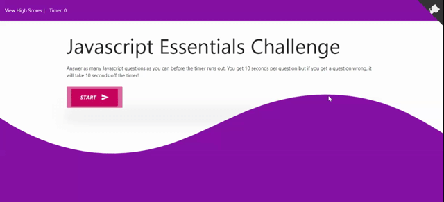

# Javascript-Quiz
[](https://opensource.org/licenses/MIT)

[](https://github.com/jessicablank/javascript-quiz/issues)
[](https://github.com/jessicablank/javascript-quiz/stargazers)


[Deployed on GitHub Pages: https://jessicablank.github.io/javascript-quiz/](https://jessicablank.github.io/javascript-quiz/)


## Description:  
A timed vanilla Javascript quiz coded with HTML, Javascript, and SCSS. The High Scores are saved in local storage so you can see your improvement over time! 

Please feel free to contribute quiz questions in questions.js. 

## Table of Contents:
* [Project Story](#project-story)
* [Action Gif](#action-gif)
* [Local Installation](#local-installation)
* [Technologies Used](#technologies-used)
* [File Structure](#file-structure)
* [Questions](#questions)
* [License](#license-info)

## Project Story
This was my first coding crash during coding boot camp. I didn't give myself enough time to complete the assignment between classes, work, and the general malaise of 2020. I asked the teacher if he thought I could continue with boot camp. His advice was to keep going and come back to this one later, so I did just that.

### MVP
The Minimum Viable Product (MVP) for this assignment requirements are:
- Upon clicking the `start` button, the user will be presented with quiz questions as a timer counts downs. 
- For every wrong answer, time will be subtracted from the clock. 
- When all questions are answered or the timer reaches zero, the quiz is over and the user is presented with a score. 
- The user can save their initials and score in local storage. 

### Re-do
I was bothered by the general requirements that did not require the application to display a score to the user. I added that functionality as well as some fun response feedback as the user is taking the quiz. 

## Action Gif



## Local Installation

Fork, Clone, or Download! 

Runs in browser and no dependencies. The [VS Code Live SASS Compiler](https://marketplace.visualstudio.com/items?itemName=ritwickdey.live-sass) extension is very handy if you would like to edit the .scss file.  

## Technologies Used
I challenged myself to use Materialize frame along with SCSS because I am more comfortable with [Bootstrap](https://getbootstrap.com/). I found both CSS tools to be an excellent combination for creating a colorful and responsive application.

- [Materialize CSS](https://materializecss.com/)
- [Sass CSS](https://sass-lang.com/)
- [Shape Divider App](https://www.shapedivider.app/)

## File Structure
```
├── assets
|  ├── highscores.js
|  ├── questions.js <---~~^-^~~Contribute Here ~~^-^~~~---->
|  ├── quiz.js
|  ├── style.css
|  ├── style.css.map
|  └── style.scss
├── highscores.html
├── index.html
└── README.md
```

## Questions
You can reach the author, Jessica Blankemeier, via [jessicablankemeier@gmail.com](mailto:jessicablankemeier@gmail.com)

## License
Copyright 2020 - present Jessica Blankemeier.
This project is licensed under the terms of the MIT license. 
More information is available at [opensource.org/licenses](https://opensource.org/licenses/MIT)

[Back to Top](#table-of-contents)